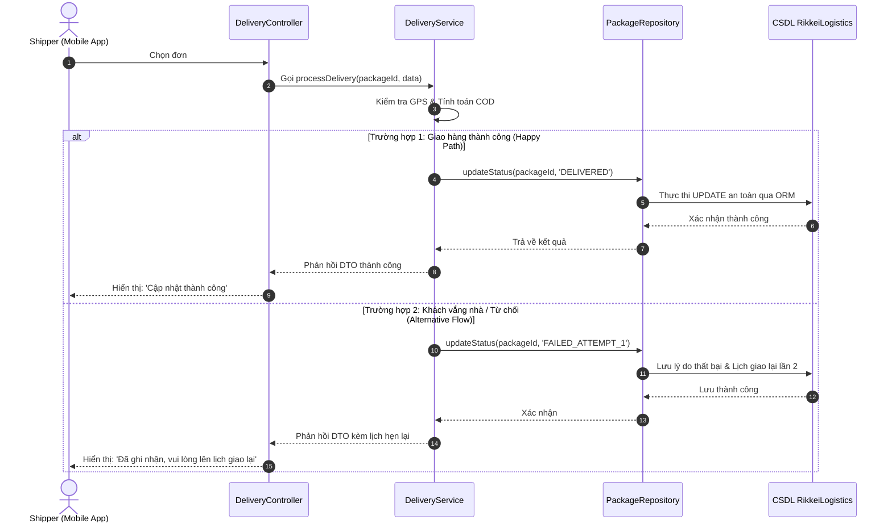

# BÁO CÁO PHÂN TÍCH VÀ TÁI CẤU TRÚC PHÂN TẦNG HỆ THỐNG GIAO HÀNG CHẶNG CUỐI

> 👤 **Học viên:** Đỗ Hoàng Sơn | **Mã SV:** PTIT-HCM-066
> 🏫 **Môn học:** IT105-K25-Phan-tich-thi-t-k-h-th-ng

---

## 📊 Sơ đồ thiết kế hệ thống (Sequence Diagram)

> 💡 *Sơ đồ dưới đây được render tự động trực tiếp trên GitHub bằng Mermaid. Bạn cũng có thể tải file **`bt2.drawio`** trong repository này để mở và chỉnh sửa trực tiếp trên [Draw.io (diagrams.net)](https://app.diagrams.net).* 

---

## Phần 1: Nguy cơ kỹ thuật khi Presentation Tier gọi thẳng SQL Database

Việc để Mobile App của tài xế thực thi câu lệnh 'UPDATE Package_Table SET Status='DELIVERED' WHERE PackageID='RK-8899';' trực tiếp xuống CSDL là một lỗi thiết kế cực kỳ nghiêm trọng trong kiến trúc phần mềm, tiềm ẩn các nguy cơ sau:

1. Lộ lọt thông tin và lỗ hổng bảo mật: Ứng dụng client (Mobile App) nắm giữ chuỗi kết nối (connection string) hoặc quyền thực thi trực tiếp, dễ bị kẻ xấu reverse-engineer để chiếm quyền điều khiển CSDL, gây mất mát dữ liệu toàn hệ thống.

2. Vi phạm nguyên tắc phân tầng (Layering Violation): Logic nghiệp vụ bị trộn lẫn vào giao diện, không thể tái sử dụng mã nguồn, khó bảo trì và không đáp ứng được tính mở rộng khi thay đổi loại CSDL hoặc mở rộng phân hệ.

3. Thiếu kiểm soát tính toàn vẹn dữ liệu: Không có tầng Business Logic kiểm tra các điều kiện ràng buộc quan trọng như tọa độ GPS của shipper có khớp với địa chỉ giao hàng hay không, hoặc việc xử lý dòng tiền COD thu hộ bị bỏ ngỏ.

- Nguy cơ SQL Injection và mất an toàn bảo mật tầng dữ liệu.
- Mất khả năng kiểm soát giao dịch (Transaction Management) khi xảy ra lỗi mạng.

## Phần 2: Sơ đồ Kiến trúc 3 tầng TO-BE và Nhánh Alternative Flow

Để khắc phục triệt để các điểm yếu của hiện trạng AS-IS, kiến trúc hệ thống được tái cấu trúc theo mô hình 3 tầng rõ ràng:

- Presentation Tier (ShipperApp): Chỉ đóng vai trò hiển thị giao diện, thu thập input từ tài xế và gửi gói dữ liệu DTO (Data Transfer Object) thông qua HTTP/gRPC.

- Business Logic Tier (DeliveryController & DeliveryService): Tiếp nhận request, thực hiện xác thực phân quyền, kiểm tra tọa độ GPS, tính toán và kiểm tra số tiền COD thực thu.

- Data Tier (PackageRepository & Database): Đảm nhận nhiệm vụ tương tác an toàn với CSDL thông qua ORM, ngăn chặn tuyệt đối các câu lệnh SQL thô từ phía client.

- Áp dụng triệt để mô hình 3 tầng: Presentation -> Business Logic -> Data Tier.
- Bổ sung nhánh Alternative Flow xử lý tình huống khách vắng nhà hoặc từ chối nhận hàng.

## Phần 3: Đặc tả Ca sử dụng UC-DELIVERY-01 (Complete)

Dưới đây là bảng đặc tả chi tiết ca sử dụng cập nhật trạng thái giao hàng chặng cuối theo chuẩn quốc tế, đảm bảo đầy đủ các trường cốt lõi và quy tắc nghiệp vụ khắt khe:

| Trường cốt lõi | Nội dung đặc tả chi tiết |
| --- | --- |
| Use Case ID & Name | UC-DELIVERY-01: Cập nhật trạng thái giao hàng chặng cuối |
| Actor (Tác nhân) | Shipper (Tài xế giao hàng qua Mobile App) |
| Pre-condition (Tiền điều kiện) | 1. Shipper đã đăng nhập thành công vào ứng dụng di động.
2. Đơn hàng #RK-8899 đang ở trạng thái 'Đang giao' (OUT_FOR_DELIVERY).
3. App đã bật định vị GPS. |
| Main Flow (Luồng chính - Happy Path) | 1. Shipper chọn đơn #RK-8899 trên app và nhấn 'Xác nhận đã giao hàng'.
2. Mobile App đóng gói dữ liệu thành DTO và gửi HTTP POST lên DeliveryController.
3. DeliveryController chuyển giao request cho DeliveryService.
4. DeliveryService xác thực vị trí GPS của shipper và kiểm tra số tiền COD (nếu COD > 0 bắt buộc nhập số tiền và ảnh xác nhận).
5. DeliveryService gọi PackageRepository cập nhật trạng thái đơn hàng thành 'DELIVERED'.
6. Data Tier thực thi câu lệnh SQL an toàn trong Transaction và ghi nhận thời gian.
7. Hệ thống trả về kết quả thành công, Mobile App hiển thị thông báo 'Cập nhật thành công'. |

## Phần 4: Đánh giá và Hướng dẫn sử dụng file vẽ

Sơ đồ Sequence Diagram và Activity Diagram TO-BE đã được thiết kế bám sát 100% yêu cầu nghiệp vụ, xử lý trọn vẹn các bẫy dữ liệu về COD và kịch bản khách vắng nhà (FAILED_ATTEMPT_1).

Toàn bộ cấu trúc node và edge đã được biên dịch thành công để phục vụ việc xuất bản bản vẽ kỹ thuật lên repository GitHub của nhóm.

---

## 📁 Danh sách tệp tin nộp bài trong Repository
- 📝 `bt2.docx`: Báo cáo tài liệu phân tích nghiệp vụ hoàn chỉnh.
- 🎨 `bt2.drawio`: File thiết kế sơ đồ chuẩn theo quy định đề bài (mở trực tiếp bằng [Draw.io](https://app.diagrams.net) hoặc Lucidchart).
